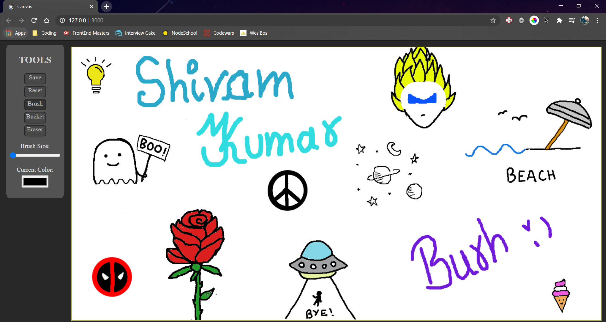

<div align="center">
  <h1>🎨 <a href="https://wandering-sage.github.io/Canvas/">Canvas</a></h1>
<p>
  <strong>A website where you can draw or paint anything. </strong>
  <br /><br />
  Build from scratch with no dependency.
</p>


<p>
  <sub>Made with ❤︎ by
    <a href="https://github.com/wandering-sage">Shivam Kumar</a>
  </sub>
</p>
</div>

## Project in Action



## Features
- You can click and drag on canvas to draw when brush tool is selected.
- You can select Bucket Tool to fill any closed shape.
- You can **download** what you have created as png image.
- You can choose the color of Brush/bucket tool.
- You can choose the size of Brush or Eraser.
- You can reset the whole canvas back to blank canvas.

## Getting Started
- Clone this repo and unzip the folder wherever you want.
- Launch your **Terminal** or **Command prompt**
- Change directory to where you unzipped this folder.
```bash
cd Desktop
cd Canvas
```
- Type npm start to run the program.
```bash
npm start
```
- The website will be running at [http://127.0.0.1:3000/](http://127.0.0.1:3000/)
- Enjoy!

## What I learnt

